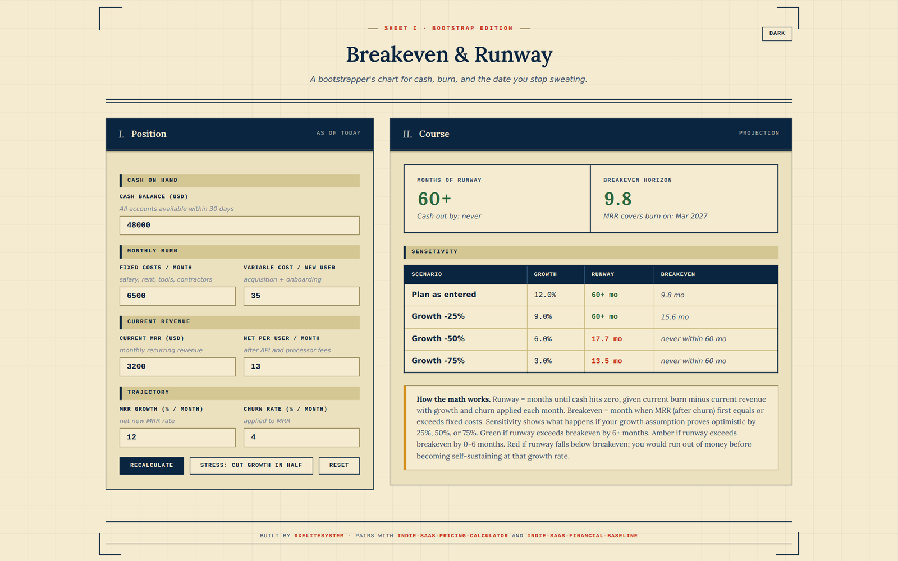

# breakeven-runway-calculator

**Live demo:** https://0xelitesystem.github.io/breakeven-runway-calculator/

Bootstrap-first runway calculator. Cash on hand, monthly burn, MRR growth, and churn. Tells you when you run out of money, when you break even, and what happens if your growth assumption is wrong.

## What it does

Enter your current cash, monthly fixed costs, current MRR, MRR growth rate, and churn rate. The tool returns:

- **Months of runway** at the current trajectory (color-coded by health vs breakeven)
- **Breakeven horizon** (the month MRR covers fixed costs)
- **Sensitivity table** showing what happens if growth drops 25%, 50%, or 75%

The headline numbers compare runway against breakeven. Green if runway exceeds breakeven by 6+ months. Amber if 0-6 months. Red if runway falls below breakeven (you'd run out of money before reaching self-sustaining MRR).

## Why bootstrap-first

Most runway calculators are built for VC-funded startups, which means they assume you'll raise again. This one assumes you won't. The "stress" button doesn't ask about your next round; it cuts your growth assumption in half because that's the actual risk for a bootstrapper.

## Inputs

| Input | What it means |
|---|---|
| Cash balance | All accounts available within 30 days |
| Fixed costs / month | Salary, rent, tools, contractors. Treats them as constant. |
| Variable cost / new user | Acquisition + onboarding cost per new customer |
| Current MRR | Your monthly recurring revenue right now |
| Net per user / month | After API and processor fees |
| MRR growth (%) | Net new MRR percentage per month |
| Churn rate (%) | MRR lost per month to cancellations |

## Outputs

- **Runway**: months until cash hits zero
- **Breakeven**: month when MRR ≥ fixed costs (after applying churn)
- **Sensitivity rows**: same calculation at 75%, 50%, and 25% of your growth assumption

## Use it

[https://0xelitesystem.github.io/breakeven-runway-calculator/](https://0xelitesystem.github.io/breakeven-runway-calculator/)

Or open `index.html` locally.

## What this tool does NOT do

- No multi-currency support; assume one currency.
- No cohort modeling; treats MRR as a single number with one growth rate and one churn rate.
- No funding round simulation; this is a bootstrapper tool.
- No connection to your accounting system; you type the numbers.
- No saved state; reload resets.

## What's not included

- No localStorage, no cookies, no tracking.
- No third-party scripts.
- No paywall.

## Pairs with

- [indie-saas-pricing-calculator](https://github.com/0xelitesystem/indie-saas-pricing-calculator): use it to figure out the "net per user / month" input here.
- [indie-saas-financial-baseline](https://github.com/0xelitesystem/indie-saas-financial-baseline): the markdown reference on indie SaaS money discipline.

## License

MIT.
